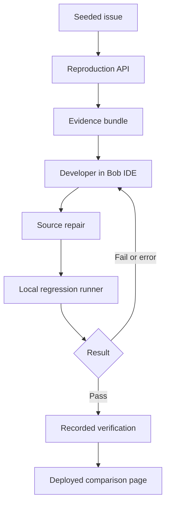

# BugReplay — complete product and technical specification

Prepared for Kunal Pandey · 25 September 2026 · Version 1.0

This specification expands the earlier BugReplay brief into an implementation contract for IBM Bob IDE. It covers the PRD, selected stack, application flow, backend, and frontend. It is a build plan, not a claim that the application or test results already exist.

## 1. Product requirements document

### Product proposition

BugReplay packages a reproducible software failure into an evidence bundle, helps a developer investigate and repair it using IBM Bob IDE, and displays traceable before/after verification. The first version supports one controlled checkout scenario. Its reusable contribution is the evidence format and repeatable workflow; the planted defect is the demonstration fixture.

### User and problem

Primary user: a solo developer or small web team receiving incomplete bug reports. Secondary user: a reviewer who needs to understand what failed, what changed, and which checks actually ran.

Problem statement: a vague report makes the developer manually reconstruct inputs, inspect code, establish a failing test, make a repair, and collect verification evidence. BugReplay brings those steps into one inspectable workflow.

Desired outcome: a reviewer can trace one reported failure from input to observed result, relevant source revision, Bob-assisted repair, and independently runnable regression test.

### Scope and important distinction

The browser application reproduces a supported synthetic scenario and exports evidence. The developer opens that evidence in Bob IDE, investigates, changes code, and runs tests. The deployed dashboard displays results captured from those real runs. There is no assumed Bob API, automatic IDE control, embedded Bob chat, or public shell execution endpoint.

An interactive reproduction calculates the sample checkout again. A recorded verification result shows a previous test run. These are labeled separately. A public user clicking “Reproduce” must never see that action described as a new Playwright test run.

### Demonstration data

Store: Northstar Demo. Currency: USD. Product A: Demo Notebook, 3,000 cents. Product B: Demo Pen Set, 2,000 cents. Quantity: one each. Coupon: SAVE10, 10% off the original subtotal once. Tax and shipping: excluded from this demo.

Expected: subtotal 5,000 cents; discount 500 cents; total 4,500 cents. Seeded faulty implementation subtracts the same 500-cent discount twice, producing 4,000 cents. This is a duplicate subtraction, not two successive percentage discounts (which would produce 4,050 cents).

All fixtures are synthetic and authored for the project. No customer names, emails, addresses, payment details, client repositories, production logs, social media content, or other personal information are needed.

### Functional requirements

| ID | Requirement | Acceptance condition |
| --- | --- | --- |
| FR-01 | Show seeded report | BUG-001 includes title, input, expected result, and steps |
| FR-02 | Reproduce scenario | Server computes the selected demo variant and returns actual total plus ordered events |
| FR-03 | Export evidence | Downloaded JSON includes scenario, steps, expected/observed values, schema version, and reproduction timestamp |
| FR-04 | Bob investigation handoff | User can copy a scoped investigation prompt and open the exported file in Bob IDE |
| FR-05 | Display repair | Page shows a real source diff and human-reviewed diagnosis with origin clearly labeled |
| FR-06 | Show verification | Recorded result has command, time, source revision, input identity, pass/fail counts, and raw artifact link |
| FR-07 | Compare before/after | Same regression expectation fails against the historical buggy source and passes against repaired source |
| FR-08 | Reset | Reset clears local reproduction state and restores seeded cart without affecting other visitors |
| FR-09 | Missing/error state | Missing evidence displays “Not recorded”; invalid input produces a useful error, never a green badge |
| FR-10 | Preserve Bob evidence | Repository includes relevant task session consumption summary screenshots in bob_sessions/ |

### Out of scope for the 48-hour MVP

Arbitrary website recording, arbitrary repositories, GitHub OAuth, payment processing, accounts, shared issue editing, automatic deployment of repairs, multi-agent runtime orchestration, and a generic AI diagnosis service. Browser end-to-end verification is desirable after the core unit regression works; sophisticated session recording is future work.

### Honest success measures

- Functional: $40 failure is reproducible; repaired source returns $45 for the same $50 cart.
- Traceability: every displayed result links to its source revision and original test artifact.
- Usability: a new viewer can reproduce the seeded issue, export evidence, and locate verification without instructions from the builder.
- Efficiency: record actual time or manual actions needed to assemble evidence with and without the tool. Use equivalent scenarios and disclose that a repeated scenario benefits from prior familiarity. One developer's demo is not a general productivity benchmark.
- Do not invent a percentage improvement. Until measured, display “Measurement pending.”

### Delivery priorities

P0: fixture, calculation module, server reproduction, report, evidence export, failing/passing regression, Bob screenshots. P1: visual comparison, source diff, deployment, short video and deck. P2: Playwright browser test, additional synthetic scenarios, richer metrics.

## 2. Selected tech stack

| Layer | Choice | Purpose |
| --- | --- | --- |
| Application | Next.js App Router + React + TypeScript | One project for UI and HTTP handlers |
| Styling | Tailwind CSS; a small reusable component set | Fast layout and consistent responsive styling |
| Validation | Zod | Validate API payloads, fixtures, and imported local run manifests |
| Backend | Next.js Route Handlers using Node runtime | Stateless reproduction and read-only evidence APIs |
| Domain logic | Pure TypeScript functions using integer cents | Deterministic totals shared by endpoint and tests |
| MVP storage | Versioned JSON fixtures and genuine recorded artifacts | Predictable deployment without database setup |
| Browser state | React state/reducer | Visitor-specific cart, request, and export state |
| Regression tests | Vitest with JSON reporting | Capture real failing and passing assertions |
| Browser checks | Playwright, one Chromium flow initially | Confirm the UI reaches the same result |
| Version control | Git with dependency lockfile | Trace source revisions and reproduce installs |
| Deployment | One Node-compatible Next.js deployment | Host frontend and stateless API together |
| Development partner | Hackathon-provisioned IBM Bob IDE | Investigation, implementation, testing, and documented evidence |

Choose mutually compatible current stable dependency versions at setup and commit the lockfile. Use an active Node LTS version that meets the installed Next.js release's requirements. This document does not pin unverified versions.

Database decision: none for the MVP. Serverless filesystems are not a persistent database; API handlers never write report files at runtime. New verification results are generated locally, validated, committed, and redeployed. Visitor reproductions remain in memory and can be downloaded. If multiuser issue creation is added later, introduce PostgreSQL and authenticated write APIs then.

## 3. App flow and architecture

### User journey

1. Open `/` and select **Explore the demo**.
2. Open `/bugs/BUG-001`: read the coupon report and reproduction steps.
3. Select **Reproduce original bug**: request a fresh deterministic computation against the isolated historical demo variant.
4. Inspect the timeline and observed $40 total; expected total remains $45. Export JSON evidence.
5. Developer opens the repository and evidence in Bob IDE, requests investigation, reviews the diagnosis, and authorizes a focused repair.
6. Developer runs the same regression assertion against buggy and repaired source revisions and exports genuine run artifacts.
7. Open `/bugs/BUG-001/verification` to compare recorded results, view the source diff, and inspect artifact provenance.
8. Select **Try repaired checkout** to compute the $45 result through the deployed repaired implementation. This is an interactive computation, distinct from the recorded test evidence.



### Report state rules

The issue definition is read-only. A browser reproduction has `idle`, `running`, `completed`, or `error` status. A completed reproduction includes `matchesExpected: true/false`; completion alone is not a pass. A test run has `passed`, `failed`, or `error`. An absent test run is rendered as “Not recorded.” “Fixed” requires a reviewed source change plus a matching passing regression artifact; a UI toggle cannot assign it.

### Deployment boundary

Browser → Next.js route handler → validated fixture/domain function → JSON response. Separately: Bob IDE on the developer's machine → source changes and local test runner → checked-in evidence artifacts → deployment. There is no network edge from the deployed app into the developer's IDE.

## 4. Backend structure

### Modules and responsibilities

| Path | Responsibility |
| --- | --- |
| `src/app/api/bugs/route.ts` | Return allowed demo reports |
| `src/app/api/bugs/[id]/route.ts` | Return one report or 404 |
| `src/app/api/reproductions/route.ts` | Validate request, execute supported scenario, return calculated observations |
| `src/app/api/bugs/[id]/verification/route.ts` | Return validated recorded before/after evidence or explicit missing state |
| `src/server/services/reproduce.ts` | Resolve scenario and allowed variant; generate ordered observations |
| `src/server/services/verification.ts` | Read manifests and check scenario/revision compatibility |
| `src/server/repositories/fixtures.ts` | Read build-bundled fictional reports/products |
| `src/server/repositories/artifacts.ts` | Load reviewed recorded manifests; no runtime writes |
| `src/domain/checkout/calculate-total.ts` | Repaired production calculation used by the app |
| `src/demo/legacy/calculate-total.ts` | Isolated historical buggy copy solely for labeled comparison |
| `src/contracts/*.ts` | Schemas and shared DTO types |
| `scripts/collect-verification.ts` | Local-only reporter normalization and artifact generation |

The historical comparison copy is created from the actual pre-fix source. Preserve its origin revision. Do not silently change that copy later or use it as the repaired application's default calculation.

### HTTP contract

| Method and path | Request | Result |
| --- | --- | --- |
| GET `/api/bugs` | None | `{data: BugReport[]}` |
| GET `/api/bugs/BUG-001` | None | Report or `404 NOT_FOUND` |
| POST `/api/reproductions` | `{scenarioId:"coupon-double-discount",variant:"original"\|"repaired"}` | Calculation and timeline, no stored record |
| GET `/api/bugs/BUG-001/verification` | None | `{data:{before:TestRun\|null,after:TestRun\|null,comparisonReady:boolean}}` |

Reject malformed JSON, unsupported scenarios, unknown variants, and extra request fields with `400 INVALID_REQUEST`. Use a small body limit such as 8 KB and return `413` above it. Known fixture missing: `404`. Unexpected calculation/read failure: `500 INTERNAL_ERROR` with a request ID. Do not expose stack traces. Public requests cannot specify filenames, commands, repository URLs, or executable code.

### Core data contracts

```ts
type Variant = 'original' | 'repaired';
type BugReport = {
  id: string;
  scenarioId: string;
  title: string;
  description: string;
  steps: string[];
  expectedTotalCents: number;
  currency: 'USD';
  fixtureVersion: string;
};
type Reproduction = {
  schemaVersion: 1;
  runId: string;
  scenarioId: string;
  variant: Variant;
  fixtureVersion: string;
  executedAt: string; // ISO timestamp for this actual request
  buildRevision: string; // deployment source revision
  observedTotalCents: number;
  expectedTotalCents: number;
  matchesExpected: boolean;
  events: { order: number; action: string; observedValue?: number }[];
};
type TestRun = {
  schemaVersion: 1;
  id: string;
  scenarioId: string;
  fixtureHash: string;
  testDefinitionHash: string;
  sourceRevision: string;
  startedAt: string;
  durationMs: number;
  runner: 'vitest' | 'playwright';
  command: string;
  exitCode: number;
  status: 'passed' | 'failed' | 'error';
  passed: number;
  failed: number;
  rawArtifactPath: string;
  rawArtifactSha256: string;
};
```

All currency computations use integer cents; `SAVE10` discounts the subtotal once and rounds to the nearest cent. The supported product catalog supplies prices; client input cannot override prices. Unsupported coupons, negative quantities, invalid product IDs, and empty carts have explicit validated outcomes. For the MVP reproduction endpoint, clients choose only the seeded scenario, so arbitrary cart validation is not exposed publicly.

### Verification artifact pipeline

1. Establish the regression assertion `calculateTotal(seedCart, 'SAVE10') === 4500` while the implementation is still buggy. Commit that test and record this source revision.
2. Run the regression in the pre-fix revision; preserve the JSON reporter output and actual failing exit status. Do not rewrite expected values to make the old code pass.
3. Use Bob IDE to repair the application calculation. Commit the repair with the same regression assertion and fixture.
4. Run the same regression in the repaired revision; preserve real output. Record failure or infrastructure error honestly if it does not pass.
5. Local collector parses raw reports, calculates hashes, records provenance, and produces before/after manifests. Missing, empty, corrupt, or zero-test reports are errors, not successes.
6. Validate that both runs concern the same fixture and regression definition. If they do not, show “Results cannot be compared.”
7. Commit sanitized artifacts and the source diff in a later evidence commit. A run manifest references the revision tested, not the later commit containing the manifest; this avoids a circular commit-hash dependency.
8. The public app reads only validated committed artifacts. It cannot alter them or run shell commands.

### Persistence and environment

`data/fixtures/` holds authored scenario JSON. `data/verification/` holds validated manifests. `public/evidence/` holds reviewed raw outputs and screenshots for download. Nothing secret belongs there. Set `BUILD_REVISION` during deployment for reproduction provenance; do not invent a value if absent—display “Revision unavailable.” No runtime AI key or database credential is required. Use strict same-origin browser requests for the POST endpoint, bounded payloads, and platform rate limiting if available.

## 5. Frontend structure

### Routes and screen responsibilities

| Route | Main content | Primary action |
| --- | --- | --- |
| `/` | Product explanation, one short workflow, demo limitation | Explore demo |
| `/bugs` | Seeded issue list; issue status and available evidence | Open BUG-001 |
| `/bugs/[id]` | Report header, expected/observed totals, ordered timeline, artifact handoff | Reproduce original bug |
| `/store` | Synthetic products and cart; original/repaired variant clearly labeled | Apply SAVE10 |
| `/bugs/[id]/verification` | Recorded test comparison, diff, timestamps, provenance, raw links | Try repaired checkout |

### Component structure

| Path | Responsibility |
| --- | --- |
| `src/components/layout/app-shell.tsx` | Sidebar/top navigation and responsive page frame |
| `src/components/bugs/issue-header.tsx` | Issue ID, title, scope and status |
| `src/components/bugs/reproduction-panel.tsx` | Async request, reset, totals, action availability |
| `src/components/evidence/event-timeline.tsx` | Ordered structured observations |
| `src/components/evidence/export-button.tsx` | Client JSON download with report and actual reproduction |
| `src/components/evidence/bob-handoff.tsx` | Copy investigation prompt and explain local IDE handoff |
| `src/components/verification/run-comparison.tsx` | Before/after results with missing/mismatch states |
| `src/components/verification/provenance-card.tsx` | Revision, command, time, input identity and artifact link |
| `src/components/verification/diff-view.tsx` | Escaped source diff, plain readable formatting |
| `src/components/store/demo-cart.tsx` | Visitor-local product selection and calculation |
| `src/components/ui/` | Buttons, cards, badges, tabs, alert, skeleton |
| `src/hooks/use-reproduction.ts` | Fetch, abort, retry and stale-response protection |
| `src/lib/format-money.ts` | Format integer cents for display |
| `src/lib/export-evidence.ts` | Build and download versioned JSON |

Pages render read-only content on the server where practical. Interactive controls are small client components. Use React state for cart, selected variant, latest reproduction and request state. Discard a late response if the user has reset or selected a different variant. Clear stale observed values when inputs change. Do not keep evidence across reloads unless the user downloads it.

### Visual direction

A precise developer workspace: dark navy background `#0B1020`, panels `#151D30`, light text `#F4F7FB`, secondary text `#A8B4CC`, cyan actions `#67E8F9`, red failures `#FDA4AF`, green passes `#86EFAC`. These are proposed tokens; check contrast in implementation. Use system sans-serif for body and monospace for IDs, amounts and code. Avoid decorative 3D elements or heavy animation during the demo.

Desktop issue page: report context left, evidence center, action/expected-versus-observed card right. Below 1,024 px, use two columns; on mobile, stack report, action card, then timeline. Do not force the full desktop layout onto a phone. Tables may scroll horizontally with visible labels.

Every status uses text and an icon, not color alone. All controls have keyboard focus. Loading announces “Reproducing scenario”; result updates use an accessible live region. Code and artifact views escape text. Empty evidence says “Run the scenario to collect evidence.” Errors include a retry button. Export is enabled only when valid evidence exists.

## 6. Implementation sequence for Bob IDE

Work in short tasks and review each diff. Record the task session consumption summary screenshots in `bob_sessions/` after each relevant task. The following are suggested prompts, not claims that Bob has already executed them.

**Task 1 — scaffold and contracts**

Read this specification. Create a single Next.js TypeScript application with Tailwind, Zod and Vitest. Implement shared contracts, synthetic fixtures and the route/component skeleton. Keep APIs stateless. Do not add authentication, a database, external AI calls or a shell execution API. Document setup commands and commit the dependency lockfile.

**Task 2 — establish the baseline**

Implement the explicitly labeled synthetic double-discount fixture and the regression assertion that a 5000-cent cart with SAVE10 must total 4500 cents. Run the test and preserve the genuine failure report. Do not change the expected result to pass. Record the source revision and fixture identity. Explain that this intentionally seeded defect is the demo baseline.

**Task 3 — evidence workflow**

Implement POST /api/reproductions for the supported scenario and strict variant enum. Add report detail, ordered timeline, JSON evidence export, loading/error/reset states and Bob IDE handoff. Keep original demo behavior isolated and clearly labeled. Verify that reset prevents stale responses from repopulating the UI.

**Task 4 — repair and verify**

Inspect the report and calculation source. Explain the cause, apply the smallest correction to the app calculation, and run the unchanged regression assertion. Keep the historical baseline intact for labeled comparison. Save genuine test results and source diff. Handle test runner errors separately from assertion failures.

**Task 5 — provenance and finish**

Implement the local report collector and recorded verification page. Require matching fixture and test identity for comparison. Show missing evidence honestly. Make public artifacts downloadable, verify responsive layouts, run the meaningful regression and API checks, and document deployment. Do not claim a fresh test ran when only a stored report was loaded.

## 7. Meaningful checks and definition of done

- Unit: seeded buggy calculation returns 4000; repaired calculation satisfies 4500; no coupon returns 5000; supported rounding and invalid input behavior are explicit.
- Regression evidence: the same desired-total assertion fails before repair and passes afterward. The original buggy implementation can remain isolated as a demonstration fixture; normal release tests must not be left failing accidentally.
- API: valid scenario computes server-side; unknown input is rejected; malformed body returns a useful response; different visitors cannot mutate shared state.
- Artifact collector: malformed or empty reports and mismatched identities never yield a passing comparison.
- Browser: reproduction, export, reset, variant switch and missing-evidence states work. If Playwright is included, run one checkout path and retain its actual report.
- Delivery: public demo opens in a fresh browser, README gives reproducible setup, required Bob summaries are present, and video/deck show actual behavior.

## 8. Hackathon fit, limits and sources

The supplied guide requires Bob IDE as a core component, relevant task summary screenshots in the repository, and compliant participant-provided data. The synthetic fixtures avoid prohibited client, personal, confidential, and social-media data. Use the hackathon-provisioned account and monitor its stated 40-Bobcoin allocation. Bob Shell and watsonx are optional. These requirements do not imply an undocumented Bob runtime API.

The provided guide does not establish a complete scoring rubric or settle every question about pre-event code, team size or other eligibility terms. Check event-specific announcements at kickoff. This architecture is designed to meet the requirements we have read; it is not a guarantee of eligibility or a prize.

- Official guide: https://lablab-ibm-bob-2-hackathon-guide.s3.us.cloud-object-storage.appdomain.cloud/index.html
- Event dashboard: https://lablab.ai/ai-hackathons/ibm-bob-2-hackathon/live
- General submission guide: https://lablab.ai/guide
- Next.js Route Handlers: https://nextjs.org/docs/app/getting-started/route-handlers
- Vitest reporters: https://vitest.dev/guide/reporters
- Playwright reporters: https://playwright.dev/docs/test-reporters

The stack and architecture are design recommendations. The official framework documentation supports the selected route-handler and test-reporting mechanisms. No production performance, security certification, or winning likelihood is claimed.
